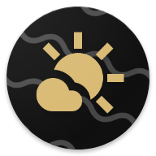
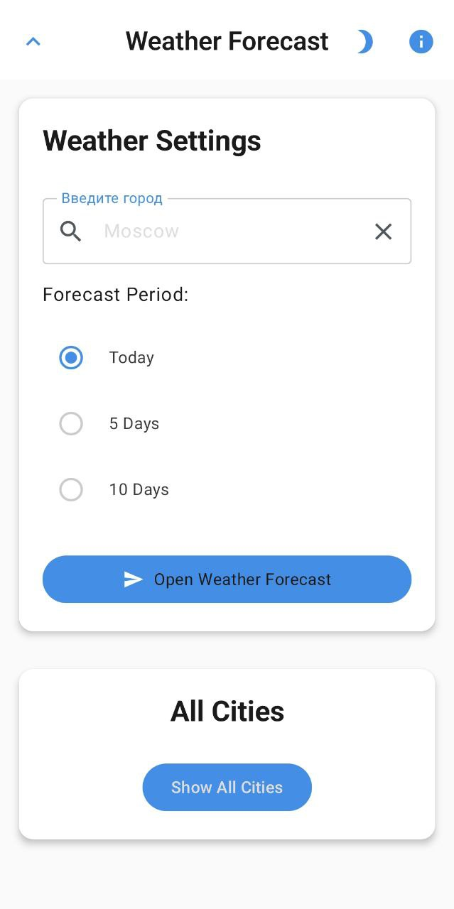
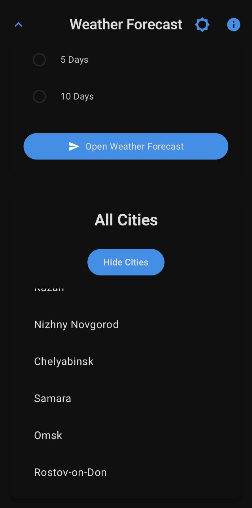
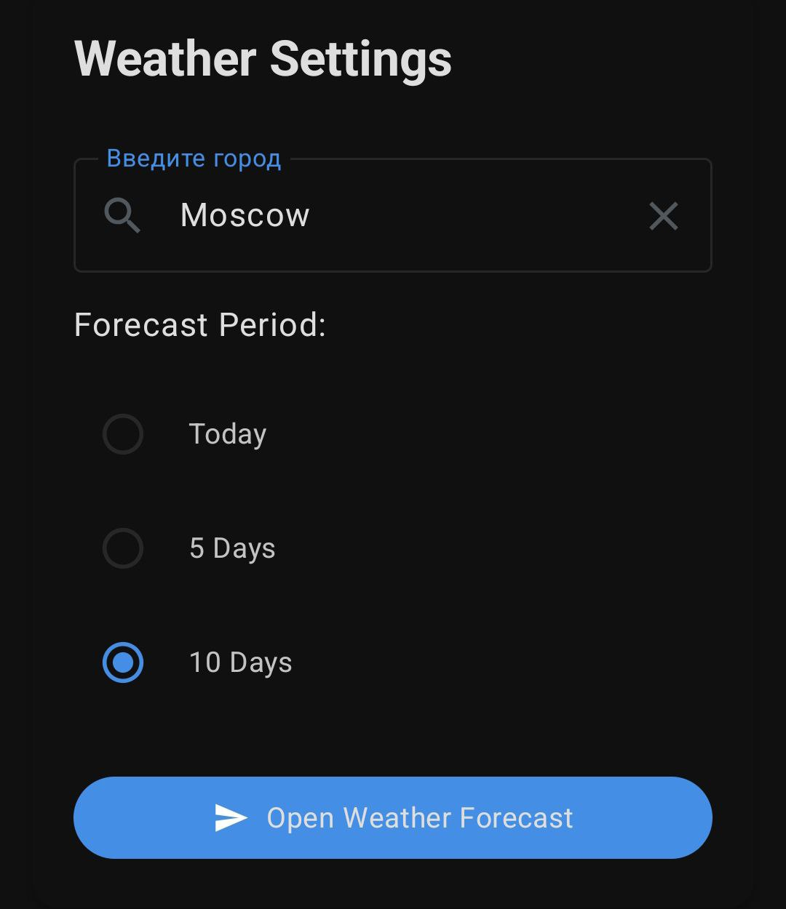
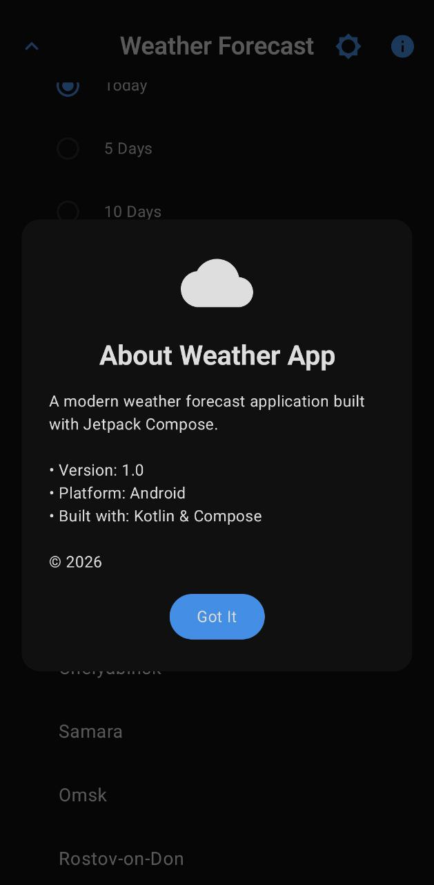

# weather-request-android-app

- Простое приложение для Android, позволяющее просматривать прогноз погоды.
- Пользователь может выбрать город из списка популярных городов.
- При выборе города открывается веб-страница с актуальным прогнозом с сайта Яндекс.Погода.
- Поддерживает светлую и тёмную темы, адаптивный интерфейс.

# Showcase

## Светлая и темная тема

| Светлая тема | Темная тема |
|--------------|-------------|
|  |  |

## Settings

## About

---

## License

This project is licensed under the MIT License. See the [LICENSE](./LICENSE) file for details.
